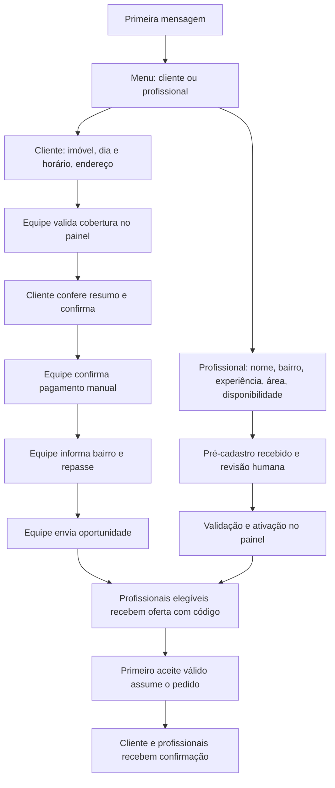

# Revisão do fluxo WhatsApp — 04/10/2026

## Contexto e fluxo operacional

AllSet organiza pedidos de limpeza residencial e o recrutamento de profissionais.
O WhatsApp recebe as conversas; o painel permite revisão humana, confirmação de
pagamento e envio de oportunidades. O pagamento atual é registrado manualmente.



O cadastro inicial da profissional não a ativa automaticamente. O matching usa
status ativo/preferencial, disponibilidade, área de atendimento e compromissos
já aceitos. O bairro e o repasse são informados pela equipe; não há cálculo
automático de comissão nesta mudança.

## Alterações realizadas

| Trecho | Problema encontrado | Correção |
| --- | --- | --- |
| Número | O destinatário interno do webhook era genérico | `WHATSAPP_NUMBER=5585987231727` no `.env`, template e validação; webhook registra o número configurado |
| Webhook | Corpos inesperados e identificadores sem telefone | Validação do formato, descarte de grupos/ecos e uso do telefone alternativo quando o JID é LID |
| Conversas | Reentrega e início concorrente podiam duplicar menu/cadastro | Chaves estáveis de idempotência, consumo do inbound e bloqueio por cliente/lead |
| Resumo | Reenvio incompleto ou preço alterado depois do pedido | Resumo com endereço, horário, duração e preço gravado no pedido |
| Edição | Alterar horário podia repetir endereço já validado | Retorno à confirmação quando a cobertura continua válida |
| Endereço | Troca mantinha cobertura e dados antigos | Limpeza da validação, bairro e repasse; nova revisão da cobertura |
| Pausa | `PARAR` não era tratado em todas as etapas | Pausa também no pagamento/revisão e retomada por `MENU`; cobertura atendida preserva a pausa |
| Pré-cadastro | Finalização sem aviso ao candidato | Confirmação de recebimento do pré-cadastro |
| Pedido pago | Bairro e repasse ausentes bloqueavam o envio | Formulário no painel, validação de valores/etapa e auditoria; envio explícito após salvar |
| Matching | Alteração concorrente podia enviar dados de uma leitura anterior | Compare-and-set com versão do pedido ao criar a oportunidade |
| BullMQ | Nome de fila com `:` e IDs incompatíveis | Prefixo separado do nome e hash estável para IDs |
| Worker | Valores padrão validados não eram usados | Leitura do `.env`, uso dos valores normalizados, repasse de configurações pelo Compose |
| Despacho | Lotes completos e falhas ficavam dependentes do próximo cron | Continuação do lote e publicação de tentativas com atraso |
| Painel | Algumas respostas gravadas esperavam o cron | Aviso ao worker depois da cobertura e retomada da conversa |
| Outbox | Worker antigo podia sobrescrever envio concluído após expiração da lease | Gravação condicionada à tentativa e lease que pertence ao worker |
| Áudio | Transcrição existente não recuperava roteamento interrompido | Busca de inbound ainda não consumido mesmo com texto transcrito |
| Áudio | Falha mantinha lease e atrasava nova tentativa | Liberação da própria lease em falha, proteção contra worker antigo e timeout de transcrição |
| Lembretes | Clientes já lembrados ocupavam o começo do lote | Rastreamento do último lembrete e claim da versão exata da conversa |

## Testar sem URLs públicas

Com Node, pnpm, dependências instaladas e Docker Desktop funcionando:

```powershell
pnpm.cmd test:whatsapp
```

O comando cria PostgreSQL e Redis descartáveis e usa mensagens simuladas. As
URLs locais são definidas apenas no processo de teste. Ele não modifica o
`.env`, não usa o banco de operação e não envia mensagens à Evolution ou à OpenAI.
O Redis usa uma porta aleatória; os containers são encerrados ao final.

Os cenários verificam:

- Cliente do menu até confirmação/pagamento, com preço preservado.
- Pedido pago, informação de bairro/repasse, oportunidade e aceite por código.
- Edição de horário e de endereço.
- `PARAR`, `MENU` e validação de cobertura durante a pausa.
- Início concorrente e webhook repetido.
- Lote e concorrência de lembretes.
- Recuperação de áudio já transcrito e nova tentativa após falha.
- Finalização do cadastro da profissional.
- Lease expirada da outbox sem sobrescrever envio concluído.
- Fila real Redis com prefixo, deduplicação e retry.
- Normalização de payloads do webhook.

Para rodar toda a integração, em PowerShell:

```powershell
$env:BETTER_AUTH_URL = 'http://localhost:3000'
$env:S3_PUBLIC_URL = 'http://localhost:9000'
pnpm.cmd test:integration --maxWorkers=1
```

O limite de um worker evita a concorrência de vários containers e migrações
nesta máquina. As URLs acima também não são gravadas no `.env`.

## Configuração para o atendimento real

- `BETTER_AUTH_URL` e `S3_PUBLIC_URL` no `.env` local ainda têm placeholders.
  O teste automatizado substitui essas URLs no processo; iniciar o app exige URLs válidas.
- Para testar apenas a lógica, não é necessário domínio público. Para conversar
  pelo WhatsApp real, a Evolution precisa alcançar o endpoint do webhook. Isso
  pode ser resolvido por rede acessível ou túnel durante desenvolvimento.
- Alterar `WHATSAPP_NUMBER` não troca o aparelho conectado à Evolution.
  A instância precisa estar pareada com o WhatsApp desse número.
- `REDIS_URL` não está configurado no `.env` local. Configure-o no app e execute
  o worker, usando o mesmo `JOB_QUEUE_PREFIX` nos dois processos. Sem Redis,
  o webhook faz uma tentativa de envio inline; o cron continua necessário.
- O envio de áudio com URL assinada precisa ser acessível à Evolution.
  Download/transcrição de áudio recebido também exige Evolution, storage e
  transcritor disponíveis na rede dos processos envolvidos.
- Mantenha os crons de despacho, recuperação de áudio, expiração e lembretes
  como reconciliação. O worker não consulta automaticamente toda a outbox sem
  receber jobs. Publicações no webhook usam promises em background; o modelo
  atual pressupõe processo Node persistente, como descrito no runbook de VPS.

## Aplicação no banco de operação

Foi criada a migração `20261004190000_add_customer_reengagement_tracking`, que
adiciona `lastReengagementAt` e recupera o histórico de lembretes já enfileirados.
As migrações foram executadas apenas em bancos descartáveis durante os testes.
Antes de iniciar a versão atualizada no ambiente operacional, execute o processo
usual de deploy, incluindo `pnpm prisma migrate deploy` e geração do Prisma Client.

## Limites da verificação

### Resultados nesta máquina

| Verificação | Resultado |
| --- | --- |
| Testes unitários | 100 aprovados, 26 arquivos |
| Integração completa, um worker | 69 aprovados, 15 arquivos |
| `test:whatsapp` | 17 aprovados, 3 arquivos; subconjunto dos testes acima |
| TypeScript, ESLint | Aprovados |
| Limites arquiteturais e código sem uso | Aprovados; Knip apresenta apenas sugestões de configuração |
| Build de produção | Aprovado com URLs locais fornecidas ao processo |

As primeiras execuções expuseram falhas no fluxo e nos fixtures de teste;
os resultados acima são das execuções depois das correções.

A simulação valida banco, transições, conteúdo das mensagens e transporte mock,
além da fila Redis real. Ela não comprova o pareamento do número, a conectividade
do webhook, o formato da mídia na versão instalada da Evolution ou a entrega
no aplicativo WhatsApp. Esses pontos precisam de uma conversa real de homologação.
A interface nova foi verificada por lint, tipos e compilação; a interação visual
no navegador ainda não foi homologada.

A entrega da outbox continua sendo **at-least-once**. Uma falha de rede depois
que o provider recebeu a mensagem pode produzir reenvio, dependendo do suporte
de idempotência do provider. A proteção de lease evita sobrescrever o estado no
banco e não promete entrega externa exatamente uma vez.
